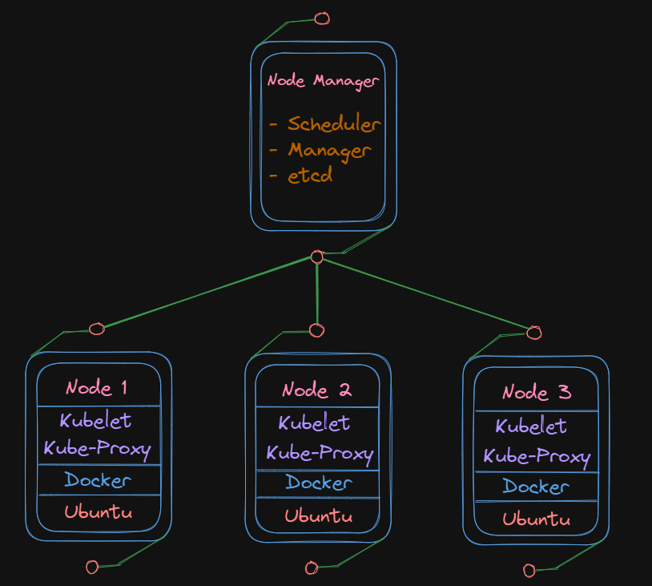

# Kubernetes Raspberry Pi 4 Cluster

This is documentation on how I have configured a kubernetes cluster in my raspberry pi homelab. this will be the IoT to run development services in my home lab such as Spark clusters, APIs, and Microservices



## Overview

This homelab consists of 4 raspberry pis one will be designated as the manager service for the kubernetes cluster will the others will be nodes 1-3.

Two things to not about the hardware choices:

One, I went with 1tb ssds, while that may be overkill in some cases some of these pis will also be used to house databases and blob storage outside of the kubernetes cluster so better safe than sorry. Plus we want the added benefit of the 300mb/sec read/write speeds the a ssd provides in most applications we will use on the pis as rather than the 30mb/sec from the micro sd. Note you can boot the ubuntu server but were will just boot it for the micro sd.

Two, The PoE switch is rated for 78w of power so roughly 78w/4 = 19.5w per pi. This should be find to power pi in most cases since the standard pi power supply is 15w but with the added power draw from the ssd, poe hats and fans, this could cause issues under heavy loading in the long run. I would recommend if your conserned with underpowering to pis to try and find a 100w rated PoE switch to so you can consitantly get that sweet spot, 20w per pi with a 20% overhead.

### Hardware

- 4x Raspberry Pi 4b (8gb ram)
- 4x 32gb Micro sd (Boat loading)
- 4x 1tb SSD (usb 3 to sata connection)
- 4x Raspberry Pi PoE Hat
- Mokerlink 78w 4-port PoE switch
- 2x Cooling Fans

### Software

- Ubuntu Server 22.0.4.3 x64 LTS
- Kubernetes (k3s)
- Grafana
- Prometheus
- Rancher

## Configuring Ubuntu Servers

Configuring Ubuntu Server for pis is pretty straight forward:

Download the [Raspberry Pi Imager](https://www.raspberrypi.com/software/). Select your flavor of ubuntu server under general OS
(**Go with a x32 installation if using pi 3 or low ram pi 4**). Select a micro sd to install it on. Then in advanced setting configure ssh. Repeat x3

Make sure to upgrade and reboot the servers

```bash
$ sudo apt update
$ sudo apt upgrade -y
$ sudo reboot
```

## Patitioning SSD

Since we will want to run docker and kubernetes off of an SSD, we will need to patition the SSDs and make sure they are mounted on boot

List all available storage

```bash
$ sudo fdisk -l
```

locate your SSD then create a patition table

```bash
$ sudo fdisk /dev/sda
- Press `g` to create a new empty GPT partition table
- Press `n` to add a new partition (accept default settings)
- Press `w` to write the changes and exit
```

Format the SSD partition

```bash
$ sudo mkfs.ext4 /dev/sda1
```

Create a mount point

```bash
$ sudo mkdir /mnt/ssd
```

Mount the SSD

```bash
$ sudo mount /dev/sda1 /mnt/ssd
```

Update /etf/fstab to make sure the SSD mounts automatically on boot

```bash
$ echo "/dev/sda1 /mnt/ssd ext4 defaults 0 0" | sudo tee -a /etc/fstab
```

## Setup Kubernetes (K3S)

We are going to use the k2s version of kubernetes because it is lightweight, good for edge computing, and much easier to set up. By default k3s uses containerd as a container runtime so no need to install docker unless your building images on the pis or just want to.

Setup the cgroup config for k3s to run

```bash
$ sudo nano /boot/cmdline.txt
- Add the following
cgroup_enable=cpuset cgroup_memory=1 cgroup_enable=memory
```

Reboot the server for changes to take affect

```bash
$ sudo reboot
```

Switch to root

```bash
$ sudo su -
```

Install k3s on our SSD

```bash
$ curl -sfL https://get.k3s.io | INSTALL_K3S_EXEC="--data-dir /mnt/ssd/k3s" sh -
```
